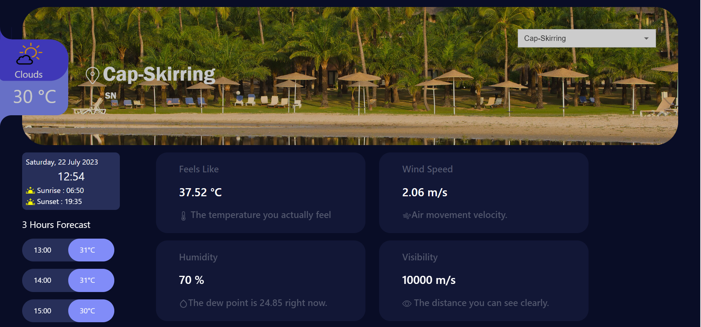
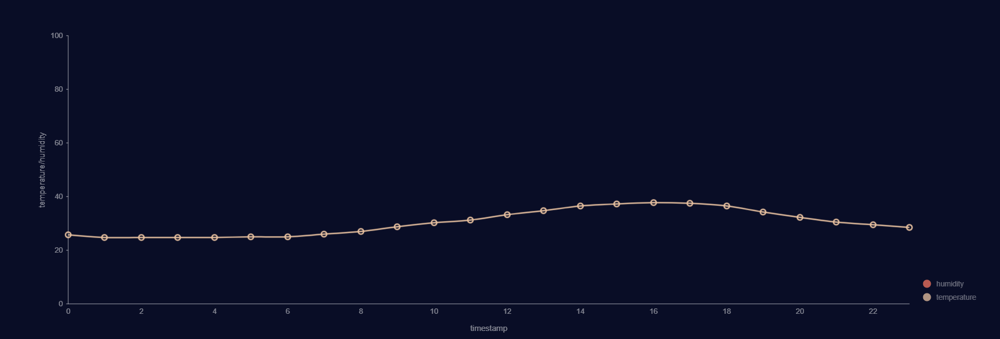

# Real Time Weather Data Pipeline App

The App is a web-based application that provides real-time weather information for many location Senegal. Users can easily search for a location by name, and the app will display the current temperature, conditions, and wind speed. This app was made in React and Express.js.

**_Demo is available [here](https://drive.google.com/file/d/1JljI9L7z8Q8N1XB0GEF7gTe9rIeLC1gB/view?usp=sharing)._**

## Available Scripts

To run the app locally, you can run these command in the project directory:

```shell
cd backend
node index.js
cd ..
npm start
```

# Screeshots



